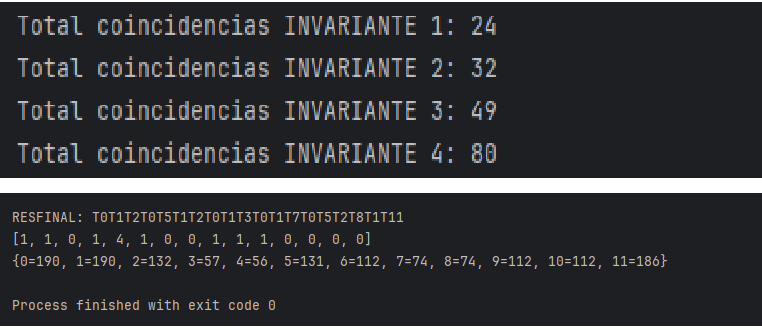

# Trabajo Práctico Final - Programación Concurrente 2024

Este proyecto implementa una **Red de Petri** que modela un sistema de gestión para una agencia de viajes, desarrollado en lenguaje Java con un monitor de concurrencia. El programa está diseñado para cumplir con los requisitos del enunciado del Trabajo Práctico Final de la materia Programación Concurrente 2024.

## Objetivos del Proyecto

- Modelar una Red de Petri que represente las operaciones de la agencia.
- Implementar un **monitor de concurrencia** para gestionar el disparo de transiciones.
- Garantizar propiedades de la red, como vivacidad, seguridad y ausencia de deadlocks.
- Implementar políticas de resolución de conflictos:
    1. **Política Balanceada**.
    2. **Política de Procesamiento Priorizado**.
- Realizar análisis temporales, de invariantes y balance de carga.

## Estructura del Proyecto

### Clases Principales

1. **Main**: Punto de entrada del programa. Configura la Red de Petri, define responsabilidades de hilos y ejecuta la simulación.
2. **RedDePetri**: Clase que modela la red. Maneja las transiciones, los estados y las propiedades de la red.
3. **Monitor**: Implementación del monitor de concurrencia que sincroniza y controla los disparos de transiciones.
4. **Colas**: Implementa las colas de espera asociadas a las transiciones sensibilizadas.
5. **Politica**: Implementa las políticas de resolución de conflictos.
6. **ProgramLogger**: Registra los eventos de la red (transiciones disparadas e invariantes) para su análisis posterior.
7. **HilosRed** y **Gestor**: Gestionan la creación y ejecución de hilos responsables de las transiciones.

### Archivos Clave

- **`Enunciado TP Final Concurrente 2024.pdf`**: Documento original con los requisitos del proyecto.
- **`transiciones.log`** y **`invariantesDePlaza.log`**: Archivos generados por el programa para registrar resultados.

## Funcionalidades Principales

1. **Definición de la Red de Petri**:
    - Configuración de la matriz de incidencia.
    - Inicialización del marcado inicial.

2. **Simulación Concurrente**:
    - Uso de múltiples hilos para disparar transiciones.
    - Sincronización mediante un monitor y semáforos.

3. **Políticas de Resolución de Conflictos**:
    - **Política Balanceada**: Equilibra la carga entre los agentes y entre reservas confirmadas/canceladas.
    - **Política de Procesamiento Priorizado**: Prioriza ciertas transiciones según los criterios definidos.

4. **Registro de Resultados**:
    - Log de transiciones disparadas.
    - Verificación y registro de invariantes de plaza.

## Requerimientos Técnicos

- **Lenguaje**: Java.
- **Herramientas**:
    - Simulador de Redes de Petri (ej.: PIPE, Petrinator).
    - IDE de desarrollo Java (IntelliJ IDEA, Eclipse).

## Ejecución del Proyecto

1. Clonar este repositorio:
   ```bash
   git clone https://github.com/Marcktm/AgenciaDeViajesProgConcurenteFinal.git
   ```
2. Compilar y ejecutar el programa:
   ```bash
   javac Main.java
   java Main
   ```
3. Revisar los archivos de log generados para analizar los resultados.

## Resultados y Análisis

- **Invariantes de Plaza**: Verificación tras cada disparo de la red.
- **Análisis Temporal**: Variación de tiempos asignados a transiciones y su impacto en el desempeño.
- **Balance de Carga**: Comparación entre las políticas implementadas.



## Referencias

- Enunciado oficial del TP Final 2024.
- Artículos sobre Redes de Petri y programación concurrente.
- Sitios útiles: [regex.com](http://www.regex.com), [debuggex.com](http://www.debuggex.com).

---
